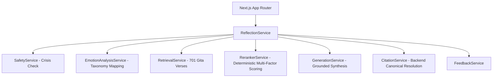

# 🧘 Drishti — Modern Vedic Wisdom Reflection Companion

> Timeless perspectives from the Bhagavad Gita for navigating modern life with equanimity and clarity.

Built directly from the **Stitch design system** ("Modern Ancient" aesthetic) and the **Vedic Wisdom Reflection Companion PRD & Implementation Plan**.

---

## ✨ Features

- **Pebble-Shaped Emotion Cards**: 12 organic emotion entry points (Anxious, Overwhelmed, Confused, Heavy, Hopeful, Seeking, Angry, Jealous, Grieving, Lonely, Restless, Fearful) with fluid micro-interactions and Material Symbol icons.
- **Mindful Journaling & Voice Input**: Free-form text input with speech-to-text integration and keyboard shortcuts (`⌘+Enter`).
- **5-Section Structured Reflection**:
  1. **What I Hear**: Empathetic, compassionate acknowledgment of the user's emotional state.
  2. **A Perspective to Sit With**: Core canonical Bhagavad Gita verse citation.
  3. **The Teaching**: Timeless philosophical insight explained with clarity.
  4. **For Your Situation**: Practical, non-dogmatic application to the user's daily life.
  5. **Reflect on This**: Parchment-styled contemplative question for deep introspection.
- **4-Layer Trust Model**:
  - **Layer 1**: Original Devanagari Sanskrit text.
  - **Layer 2**: Classical word meanings & translations.
  - **Layer 3**: Traditional commentary (when verified).
  - **Layer 4**: AI synthesis & practical application.
- **Backend-Owned Citations**: The LLM never hallucinates citations; verses are resolved and validated against the authoritative canonical corpus.
- **Safety-First Pipeline**: Deterministic crisis classifier runs *before* RAG retrieval, immediately providing helpline support and pausing spiritual advice during crises.
- **Offline & Cloud Ready**: Complete 701-verse Bhagavad Gita corpus built-in; runs seamlessly in-memory or connected to MongoDB Atlas Vector Search.
- **Reflections Archive**: Saved reflections stored with dates, emotion tags, and scripture references.

---

## 🚀 Quick Start

### 1. Install Dependencies
```bash
npm install
```

### 2. Run Development Server
```bash
npm run dev
```
Open [http://localhost:3000](http://localhost:3000) in your browser.

### 3. Run Automated Tests
```bash
npm test
```

### 4. Run Standalone RAG Evaluation
```bash
npm run evaluate:rag
```

---

## 🎨 Design System

Styled according to the Stitch MCP Design Specification:
- **Palette**: `surface: #fcf9f2`, `primary: #171614`, `gold: #D4AF37`, `secondary: #735c00`, `parchment-deep: #E8E2D2`, `muted-stone: #8C857B`.
- **Typography**: `Literata` (Serif / Scripture), `DM Sans` (UI & Body), `Noto Sans Devanagari` (Sanskrit).
- **Glassmorphism**: Backdrop blur with golden ambient glows and pulsing lotus animations.

---

## 📚 Architectural Overview



---

## ⚖️ Safety & Ethics

Drishti is designed as a philosophical companion for personal reflection. It does not provide medical, psychological, or crisis therapy. Configured with emergency helplines across India and globally.
