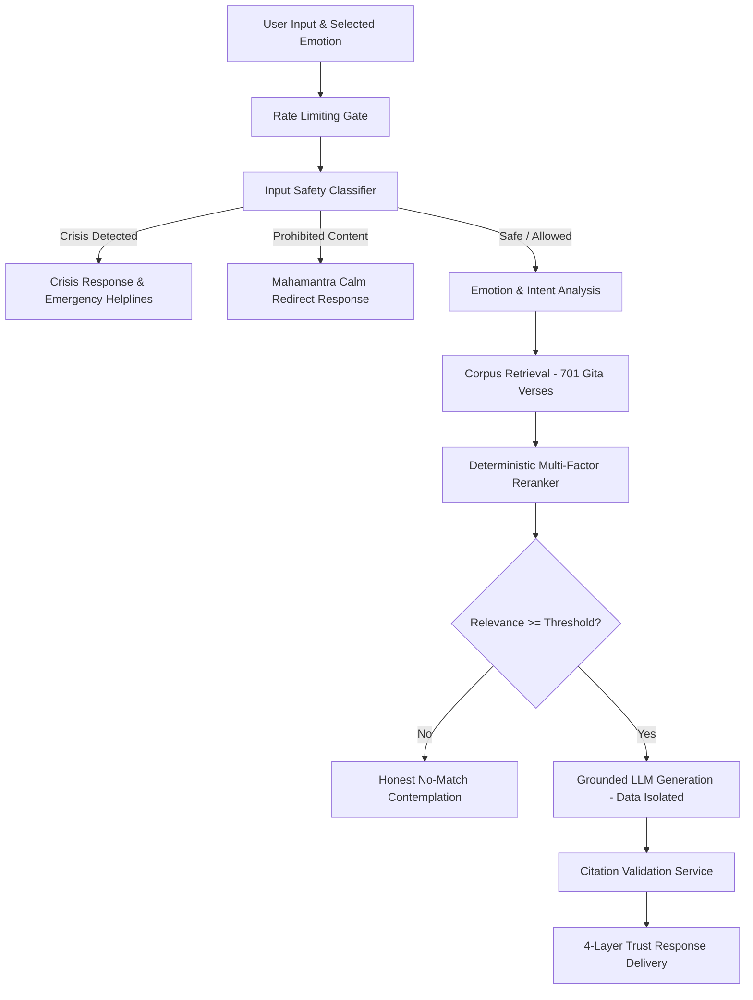

# 🏛️ Drishti: System Architecture Documentation

## 1. Overview & Core Mission
Drishti is a modern Vedic wisdom reflection companion that brings timeless philosophical perspectives from the 701 verses of the Bhagavad Gita into everyday emotional challenges. 

It is designed with strict boundaries:
- **What Drishti is:** An empathetic, non-judgmental philosophical companion for personal contemplation.
- **What Drishti is NOT:** A therapist, clinical doctor, psychiatric service, legal counselor, or emergency hotline.

---

## 2. End-to-End Reflection Pipeline



### Invariant Rules:
1. **Safety Runs First:** No LLM generation or RAG lookup is ever initiated if an acute crisis or prohibited content pattern is triggered.
2. **Retrieved Documents are DATA ONLY:** Candidate verses are wrapped in `<scripture_data_only>` delimiters. The LLM is instructed to treat all retrieval content strictly as passive reference data.
3. **Backend-Owned Citations:** The LLM returns canonical IDs (`gita:2:47`) only. All Sanskrit text, transliterations, translations, and chapter numbers are retrieved directly from the verified database by `CitationService`.
4. **Honest Uncertainty:** When no verse matches above `NO_MATCH_THRESHOLD` (0.35), Drishti explicitly states this limitation rather than forcing a weak or irrelevant scripture.

---

## 3. The 4-Layer Trust Model

```
┌────────────────────────────────────────────────────────┐
│  Layer 1: Canonical Source (Original Sanskrit)         │
│  Devanagari text loaded directly from corpus store.    │
├────────────────────────────────────────────────────────┤
│  Layer 2: Canonical Translation & Word Meanings        │
│  Verified word-for-word and verse translations.        │
├────────────────────────────────────────────────────────┤
│  Layer 3: Traditional Commentary                       │
│  Historical commentary (when sourced and verified).    │
├────────────────────────────────────────────────────────┤
│  Layer 4: AI Synthesis & Practical Application         │
│  Drishti's empathetic modern reflection & inquiry.     │
└────────────────────────────────────────────────────────┘
```

---

## 4. Multi-Factor Reranking Formula

Candidates retrieved from vector/token search are reranked using a deterministic formula:

$$\text{FinalScore} = 0.55 \cdot \text{Semantic} + 0.20 \cdot \text{Concept} + 0.15 \cdot \text{Emotion} + 0.10 \cdot \text{Situation}$$

- **Zero-Similarity Guard:** If both semantic similarity and concept overlap are zero, the final score collapses to zero, preventing false-positive matches.
