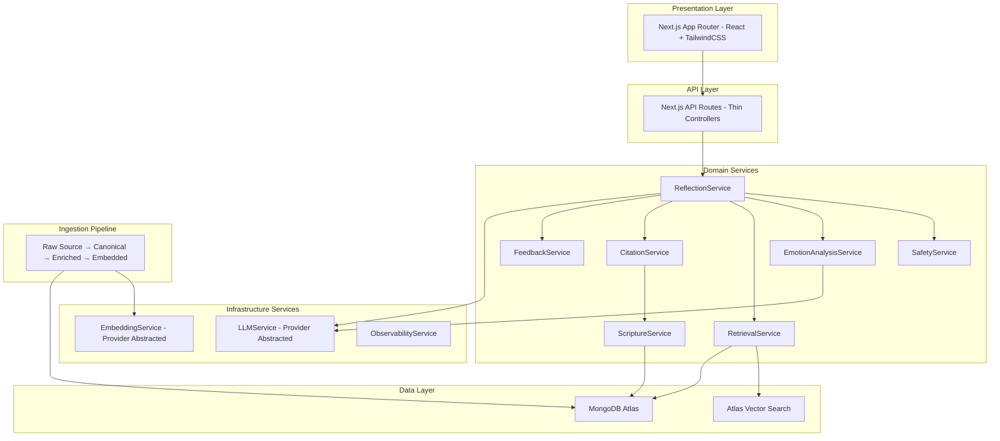
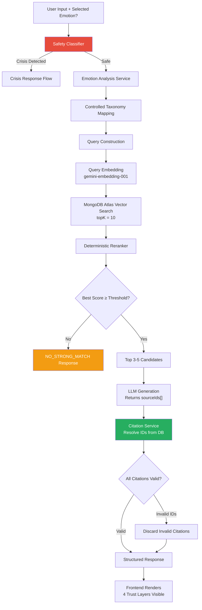
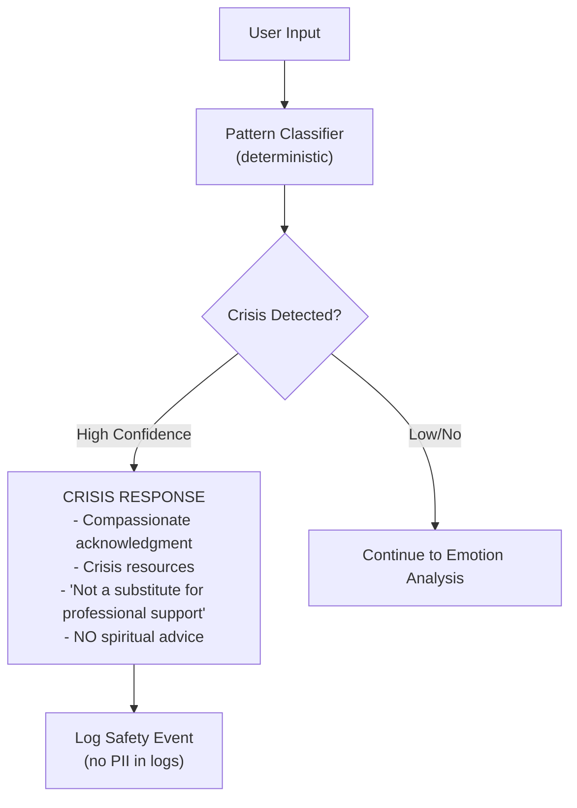

# Vedic Wisdom Reflection Companion — Revised Implementation Plan v2

> Incorporating all 54 architectural, product, and process changes from review.

---

## 1. Updated Architecture

### Architecture Overview



### Core Architectural Principles

1. **Four-layer data pipeline**: Raw Source → Normalized Canonical → Enriched Retrieval → Embedded (never mutate raw source)
2. **Content vs Metadata provenance**: Original content provenance and AI-generated metadata provenance are separate, explicitly tracked
3. **Backend-owned citations**: LLM returns `sourceIds[]`, backend resolves them against MongoDB — LLM is never the citation authority
4. **Safety-first pipeline**: Safety classifier runs BEFORE any RAG retrieval or generation
5. **NO_STRONG_MATCH as first-class outcome**: System can honestly say "no strong match found" rather than forcing a weak citation
6. **Four-layer response trust**: Original Source | Translation | Traditional Commentary | AI Interpretation — each visually distinct
7. **Domain service layer**: API routes are thin; all business logic lives in typed service classes
8. **Provider abstraction**: LLM and embedding providers behind interfaces; no hard-coded model names in business logic
9. **System prompt externalized**: `VEDIC_REFLECTION_SYSTEM_PROMPT` remains empty; infrastructure supports injection

### Technology Stack (Verified August 2026)

| Layer | Technology | Version | Notes |
|-------|-----------|---------|-------|
| Framework | Next.js | 16.3.x (latest stable) | App Router, React Server Components |
| Language | TypeScript | 5.x | Strict mode |
| Styling | TailwindCSS | 4.x | Per user approval |
| Database | MongoDB Atlas | M0 free tier (MVP) | Cloud-hosted |
| Vector Search | MongoDB Atlas Vector Search | Included with Atlas | HNSW-based ANN |
| LLM | Gemini 3.7 Flash | `gemini-3.7-flash` | Current fastest; configurable |
| Embeddings | Gemini Embedding | `gemini-embedding-001` | 3072 dims default, MRL to 768 |
| Validation | Zod | Latest | Canonical validation library |
| Testing | Jest + Playwright | Latest | Unit/integration + E2E |
| Design | Stitch MCP | — | Pixel-perfect design source of truth |

> [!WARNING]
> `text-embedding-004` was **shut down January 14, 2026**. The current model is `gemini-embedding-001` (default 3072 dimensions, supports Matryoshka down-scaling to 768). All references updated accordingly.

> [!WARNING]
> `gemini-1.5-flash` and `gemini-2.0-flash` are **retired**. Current model is `gemini-3.7-flash` (GA August 13, 2026). All references updated.

---

## 2. Updated Directory Structure

```
vedic-wisdom/
├── .env.example
├── .env.local                              # Git-ignored
├── .gitignore
├── package.json
├── tsconfig.json
├── tailwind.config.ts
├── next.config.ts
├── jest.config.ts
├── playwright.config.ts
├── README.md
│
├── docs/
│   ├── architecture.md
│   ├── api.md
│   ├── rag.md
│   ├── data-model.md
│   ├── ingestion.md
│   ├── deployment.md
│   ├── evaluation.md
│   ├── security.md
│   └── decisions.md                        # ADR log
│
├── data/
│   ├── source/                             # IMMUTABLE raw source snapshots
│   │   └── gita.json                       # 701 verses — never modified
│   ├── seed/
│   │   └── categories.json                 # Scripture categories
│   └── evaluation/
│       ├── golden-set.json                 # 25 human-curated test cases
│       └── scenarios.json                  # 50+ evaluation scenarios (incl. 10 no-match)
│
├── scripts/
│   └── ingest/
│       ├── validate-source.ts              # Validate raw source integrity
│       ├── normalize-scripture.ts           # Raw → canonical records
│       ├── enrich-metadata.ts              # AI-generated retrieval metadata
│       ├── generate-embeddings.ts           # Vector embeddings
│       ├── build-index.ts                  # MongoDB Atlas Vector Search index
│       └── evaluate-rag.ts                 # CLI RAG evaluation runner
│
├── src/
│   ├── app/                                # Next.js App Router
│   │   ├── layout.tsx                      # Root layout, fonts, metadata
│   │   ├── page.tsx                        # Homepage — emotion entry point
│   │   ├── reflect/
│   │   │   └── page.tsx                    # Reflection experience
│   │   ├── globals.css                     # Tailwind + design tokens
│   │   └── api/
│   │       ├── reflections/
│   │       │   ├── route.ts                # POST /api/reflections
│   │       │   └── [id]/route.ts           # GET /api/reflections/:id
│   │       ├── emotions/
│   │       │   └── route.ts                # GET /api/emotions
│   │       ├── sources/
│   │       │   └── route.ts                # GET /api/sources
│   │       ├── scriptures/
│   │       │   └── [id]/route.ts           # GET /api/scriptures/:id
│   │       ├── feedback/
│   │       │   └── route.ts                # POST /api/feedback
│   │       ├── admin/
│   │       │   ├── ingest/route.ts         # POST (admin JWT)
│   │       │   └── reindex/route.ts        # POST (admin JWT)
│   │       └── health/
│   │           └── route.ts                # GET /api/health
│   │
│   ├── components/
│   │   ├── ui/                             # Base UI primitives
│   │   │   ├── button.tsx
│   │   │   ├── card.tsx
│   │   │   ├── input.tsx
│   │   │   ├── textarea.tsx
│   │   │   ├── badge.tsx
│   │   │   ├── skeleton.tsx
│   │   │   └── dialog.tsx
│   │   ├── emotion-card.tsx
│   │   ├── emotion-grid.tsx
│   │   ├── reflection-input.tsx
│   │   ├── reflection-response.tsx
│   │   ├── source-citation.tsx             # Expandable — distinguishes 4 layers
│   │   ├── feedback-prompt.tsx
│   │   ├── safety-banner.tsx
│   │   ├── trust-layer-indicator.tsx       # Visual trust-layer labels
│   │   ├── header.tsx
│   │   └── footer.tsx
│   │
│   ├── services/                           # Domain service layer
│   │   ├── reflection.service.ts           # Orchestrates full reflection flow
│   │   ├── safety.service.ts               # Crisis detection (runs first)
│   │   ├── emotion-analysis.service.ts     # Structured emotion extraction
│   │   ├── retrieval.service.ts            # Vector search + metadata
│   │   ├── reranker.service.ts             # Deterministic scoring
│   │   ├── generation.service.ts           # LLM synthesis with grounding
│   │   ├── citation.service.ts             # Backend citation resolution
│   │   ├── scripture.service.ts            # Scripture data access
│   │   ├── feedback.service.ts             # Feedback storage
│   │   └── ingestion.service.ts            # Ingestion orchestration
│   │
│   ├── lib/
│   │   ├── db/
│   │   │   ├── connection.ts               # Mongoose singleton
│   │   │   └── models/
│   │   │       ├── scripture.model.ts      # Extended canonical + retrieval
│   │   │       ├── category.model.ts       # From existing repo
│   │   │       ├── reflection-session.model.ts
│   │   │       ├── reflection-message.model.ts
│   │   │       ├── feedback.model.ts
│   │   │       ├── ingestion-job.model.ts
│   │   │       └── system-config.model.ts
│   │   │
│   │   ├── llm/
│   │   │   ├── provider.interface.ts       # Abstract LLM provider
│   │   │   ├── gemini.provider.ts          # Gemini 3.7 Flash implementation
│   │   │   └── factory.ts                  # Provider factory
│   │   │
│   │   ├── embedding/
│   │   │   ├── provider.interface.ts       # Abstract embedding provider
│   │   │   ├── gemini.embedding.ts         # gemini-embedding-001
│   │   │   └── factory.ts
│   │   │
│   │   ├── safety/
│   │   │   ├── classifier.interface.ts     # Structured classifier interface
│   │   │   ├── pattern.classifier.ts       # Deterministic pattern detection
│   │   │   └── crisis-resources.ts         # Configurable crisis resource data
│   │   │
│   │   ├── emotions/
│   │   │   ├── taxonomy.ts                 # Controlled emotion taxonomy
│   │   │   └── synonym-map.ts              # Synonym → canonical emotion mapping
│   │   │
│   │   ├── auth/
│   │   │   └── admin.ts                    # Admin JWT auth only
│   │   │
│   │   ├── config/
│   │   │   ├── env.ts                      # Env var validation (Zod)
│   │   │   ├── rag.ts                      # RAG configuration constants
│   │   │   └── prompts.ts                  # System prompt placeholder (EMPTY)
│   │   │
│   │   ├── observability/
│   │   │   └── logger.ts                   # Structured logging (no PII)
│   │   │
│   │   └── utils/
│   │       ├── id.ts                       # Deterministic canonical IDs
│   │       ├── hash.ts                     # Content hashing for idempotency
│   │       ├── validation.ts               # Zod request schemas
│   │       └── rate-limiter.ts             # IP/session rate limiting
│   │
│   ├── hooks/
│   │   ├── use-reflection.ts
│   │   └── use-session.ts
│   │
│   └── types/
│       ├── api.ts                          # API request/response types
│       ├── scripture.ts                    # Scripture domain types
│       ├── emotion.ts                      # Emotion taxonomy types
│       ├── reflection.ts                   # Reflection types
│       ├── provenance.ts                   # Provenance types
│       └── rag.ts                          # RAG pipeline types
│
├── __tests__/
│   ├── unit/
│   │   ├── emotion-taxonomy.test.ts
│   │   ├── reranker.test.ts
│   │   ├── safety-classifier.test.ts
│   │   ├── citation-service.test.ts
│   │   ├── content-hash.test.ts
│   │   └── synonym-map.test.ts
│   ├── integration/
│   │   ├── reflection-api.test.ts
│   │   ├── ingestion-pipeline.test.ts
│   │   └── retrieval-service.test.ts
│   └── e2e/
│       └── reflection-flow.test.ts
│
└── jest.config.ts
```

---

## 3. Updated Database Schema

### Scripture Record (camelCase, extended)

```typescript
// src/types/scripture.ts

interface ScriptureRecord {
  // Identity
  canonicalId: string;                  // "gita:2:47" — deterministic, unique
  sourceName: string;                   // "Bhagavad Gita"
  chapter: number;
  verse: number;

  // Canonical content (from raw source — NEVER AI-generated)
  originalText: string;                 // Sanskrit in Devanagari
  transliteration: string;
  wordMeanings: string;
  translation: string;

  // Source provenance (tracks where the content came from)
  sourceMetadata: {
    sourceCorpus: string;               // "gita"
    sourceFile: string;                 // "data/source/gita.json"
    sourceUrl: string | null;           // URL if available
    originalSourceName: string;         // "Bhagavad Gita"
    translator: string | null;         // null if unknown
    commentator: string | null;        // null until verified source added
    commentary: string | null;         // null until verified source added
    license: string;                    // "unknown" | "public-domain" | "CC-BY" etc.
    provenanceStatus: ProvenanceStatus; // "known" | "unknown" | "community" | "unverified"
    contentVersion: string;             // "gita-v1.0"
    retrievedAt: string;                // ISO date
  };

  // AI-generated retrieval metadata (explicitly non-authoritative)
  retrievalMetadata: {
    philosophicalConcepts: ConceptWithConfidence[];
    emotionalThemes: ConceptWithConfidence[];
    lifeSituations: ConceptWithConfidence[];
    keywords: string[];
    metadataStatus: MetadataStatus;     // "pending" | "aiGenerated" | "reviewed" | "rejected"
  };

  // Metadata provenance (tracks HOW retrieval metadata was generated)
  metadataQuality: {
    confidence: number;                 // 0.0 – 1.0
    generatedBy: string;                // "gemini-3.7-flash"
    generatedAt: string;                // ISO date
    metadataVersion: string;            // "metadata-v1"
  };

  // Embedding
  embedding: {
    vector: number[];
    model: string;                      // "gemini-embedding-001"
    dimensions: number;                 // 768 (or 3072)
    embeddingVersion: string;           // "embedding-v1"
    embeddedTextHash: string;           // SHA-256 of the text that was embedded
  };

  // Timestamps
  createdAt: Date;
  updatedAt: Date;
}

type ProvenanceStatus = "known" | "unknown" | "community" | "unverified";
type MetadataStatus = "pending" | "aiGenerated" | "reviewed" | "rejected";

interface ConceptWithConfidence {
  concept: string;
  confidence: number;                   // 0.0 – 1.0
}
```

### Reflection Message

```typescript
interface ReflectionMessage {
  id: string;
  sessionId: string;
  
  // User input
  userInput: string;
  selectedEmotion: string | null;       // Explicitly selected by user
  
  // Emotion analysis (AI-generated understanding — NOT diagnosis)
  emotionalReading: {
    primaryEmotion: string;             // From controlled taxonomy
    secondaryEmotions: string[];        // From controlled taxonomy
    intensity: number;
    situation: string;
    trigger: string;
    underlyingConcern: string;
    themes: string[];
    philosophicalConcepts: string[];
  };
  
  // Retrieved sources (backend-resolved, not LLM-generated)
  sources: ResolvedSource[];
  
  // Generated reflection (structured)
  reflection: {
    whatIHear: string;                  // Empathetic emotional reading
    perspectiveFromText: string;        // References to retrieved verses
    teaching: string;                   // What the verse teaches
    application: string;               // Applied to user's situation
    reflectionQuestion: string;         // Closing reflective question
    caveats: string | null;             // Honest uncertainty
  } | null;
  
  // RAG outcome
  ragOutcome: "strongMatch" | "weakMatch" | "noStrongMatch";
  
  // Safety
  safetyClassification: {
    isCrisis: boolean;
    type: "selfHarm" | "harmToOthers" | "severeCrisis" | null;
    confidence: number;
  };
  
  // Diagnostics (for evaluation, not user-facing)
  retrievalDiagnostics: {
    queryEmbeddingTimeMs: number;
    retrievalTimeMs: number;
    rerankTimeMs: number;
    generationTimeMs: number;
    totalTimeMs: number;
    candidatesRetrieved: number;
    candidatesAfterRerank: number;
    topScore: number;
    noMatchThreshold: number;
    retrievedCanonicalIds: string[];
    rerankScores: { canonicalId: string; score: number }[];
  };
  
  createdAt: Date;
}

interface ResolvedSource {
  canonicalId: string;
  sourceName: string;
  chapter: number;
  verse: number;
  originalText: string;                 // From DB, not LLM
  transliteration: string;             // From DB, not LLM
  translation: string;                 // From DB, not LLM
  commentary: string | null;           // From DB only if verified
  commentator: string | null;
  translator: string | null;
  relevanceScore: number;
  provenanceStatus: ProvenanceStatus;
}
```

### Other Collections

```typescript
// Reflection Session
interface ReflectionSession {
  sessionId: string;                    // nanoid, stored in client cookie
  messages: ObjectId[];
  createdAt: Date;
  lastActiveAt: Date;
}

// Feedback
interface Feedback {
  messageId: ObjectId;
  sessionId: string;
  rating: "helpful" | "notQuite";
  comment: string | null;
  createdAt: Date;
}

// Ingestion Job
interface IngestionJob {
  jobId: string;
  sourceCorpus: string;
  corpusVersion: string;
  metadataVersion: string;
  embeddingVersion: string;
  status: "running" | "completed" | "failed";
  recordsProcessed: number;
  recordsSkipped: number;              // Already up-to-date
  recordsFailed: number;
  errors: { canonicalId: string; error: string }[];
  startedAt: Date;
  completedAt: Date | null;
}

// Crisis Resource (configurable, not hardcoded)
interface CrisisResource {
  country: string;
  resourceName: string;
  resourceType: "hotline" | "textline" | "website" | "chat";
  phone: string | null;
  website: string | null;
  source: string;
  lastVerifiedAt: string | null;       // null = NOT YET VERIFIED
  active: boolean;
}
```

---

## 4. Updated RAG Flow



### Key RAG Design Decisions

| Decision | Rationale |
|----------|-----------|
| Safety runs BEFORE RAG | Never give spiritual advice as first response to crisis content |
| Vector-only retrieval for V1 | Avoid premature complexity; lexical search is an extension point |
| Deterministic reranking | Reproducibility > LLM-determined relevance |
| NO_STRONG_MATCH outcome | Honesty > forced citation; configurable threshold |
| LLM returns sourceIds[] | Backend resolves against DB; dramatically reduces hallucination |
| Discard (never "fix") invalid citations | No LLM-on-LLM repair loops |
| Emotion analysis ≠ Retrieval ≠ Generation | Three separate service boundaries |

### Reranking Formula (Configurable Weights)

```
finalScore =
    semanticSimilarity × 0.55
  + conceptMatch       × 0.20
  + emotionalMatch     × 0.15
  + lifeSituationMatch × 0.10
```

Configured via environment:
```
RERANK_WEIGHT_SEMANTIC=0.55
RERANK_WEIGHT_CONCEPT=0.20
RERANK_WEIGHT_EMOTION=0.15
RERANK_WEIGHT_SITUATION=0.10
NO_MATCH_THRESHOLD=0.35
```

> [!IMPORTANT]
> These weights are initial heuristics, NOT scientifically optimized. The evaluation dataset will inform tuning.

---

## 5. Updated Ingestion Flow

```mermaid
graph LR
    A["data/source/gita.json<br/>(IMMUTABLE)"] --> B["validate-source.ts<br/>Verify integrity"]
    B --> C["normalize-scripture.ts<br/>Map to canonical schema<br/>Generate canonicalId"]
    C --> D["MongoDB: scriptures<br/>(canonical content only)"]
    
    D --> E["enrich-metadata.ts<br/>AI-generated concepts/themes"]
    E --> F["MongoDB: update<br/>retrievalMetadata +<br/>metadataQuality"]
    
    F --> G["generate-embeddings.ts<br/>Compose embeddingText<br/>Generate vector"]
    G --> H["MongoDB: update<br/>embedding field"]
    
    H --> I["build-index.ts<br/>Atlas Vector Search index"]
```



### Idempotency Guarantees

| Check | Mechanism |
|-------|-----------|
| Verse already canonical | `canonicalId` unique index; skip if exists with same `contentVersion` |
| Metadata already enriched | Compare `metadataVersion`; skip if current |
| Embedding already generated | Compare `embeddedTextHash`; skip if hash matches |
| Manual review preserved | Never overwrite records where `metadataStatus = "reviewed"` |

### Embedding Text Composition

```
Source: Bhagavad Gita
Chapter: {chapter}, Verse: {verse}

Translation: {translation}

Concepts: {philosophicalConcepts.map(c => c.concept).join(", ")}

Themes: {emotionalThemes.map(t => t.concept).join(", ")}

Situations: {lifeSituations.map(s => s.concept).join(", ")}
```

Kept concise and deterministic. The `embeddedTextHash` (SHA-256) enables re-embedding detection.

---

## 6. Updated Safety Flow



### Safety Architecture

```typescript
// Structured classifier interface (replaceable)
interface SafetyClassifier {
  classify(input: string): Promise<SafetyClassification>;
}

interface SafetyClassification {
  isCrisis: boolean;
  type: "selfHarm" | "harmToOthers" | "severeCrisis" | null;
  confidence: number;                   // 0.0 – 1.0
  matchedPatterns: string[];            // For audit, not user-facing
}
```

### Crisis Resources (Configurable)

```typescript
// NOT hardcoded — configurable data structure
interface CrisisResource {
  country: string;
  resourceName: string;
  resourceType: "hotline" | "textline" | "website" | "chat";
  phone: string | null;
  website: string | null;
  source: string;
  lastVerifiedAt: string | null;        // null = NOT YET VERIFIED
  active: boolean;
}
```

> [!WARNING]
> For MVP, the crisis resource infrastructure will be built and ready, but resources will be marked with `lastVerifiedAt: null` until manually verified. The documentation will clearly state that crisis-resource verification is required before production deployment.

---

## 7. Updated API Contracts

### POST `/api/reflections`

**Request:**
```typescript
{
  message: string;                      // User's emotional description
  selectedEmotion?: string;             // From emotion card (if selected)
  sessionId?: string;                   // Anonymous session continuity
  conversationId?: string;              // For multi-turn context
}
```

**Response (Success — Strong Match):**
```typescript
{
  id: string;
  sessionId: string;
  ragOutcome: "strongMatch";
  
  emotionalReading: {
    primaryEmotion: string;
    secondaryEmotions: string[];
    statement: string;                  // "What I hear" text
  };
  
  sources: ResolvedSource[];            // Backend-resolved from DB
  
  reflection: {
    whatIHear: string;
    perspectiveFromText: string;
    teaching: string;
    application: string;
    reflectionQuestion: string;
    caveats: string | null;
  };
  
  trustLayers: {
    originalSource: "fromCorpus";
    translation: "fromCorpus";
    commentary: "notAvailable" | "fromVerifiedSource";
    aiInterpretation: "aiGenerated";
  };
}
```

**Response (No Strong Match):**
```typescript
{
  id: string;
  sessionId: string;
  ragOutcome: "noStrongMatch";
  
  emotionalReading: { /* same */ };
  sources: [];
  
  reflection: {
    whatIHear: string;
    perspectiveFromText: "I couldn't find a passage that speaks directly enough to what you're describing.";
    teaching: null;
    application: string;                // General reflective response without forced citation
    reflectionQuestion: string;
    caveats: "The current corpus may not have a strong direct match for this situation.";
  };
}
```

**Response (Crisis):**
```typescript
{
  id: string;
  sessionId: string;
  ragOutcome: "crisis";
  
  crisisResponse: {
    acknowledgment: string;
    resources: CrisisResource[];
    disclaimer: string;
  };
}
```

### LLM Output Contract (Internal)

The LLM returns structured JSON validated by Zod:
```typescript
// What the LLM generates (internal — NOT sent to frontend directly)
const LLMReflectionOutput = z.object({
  emotionalReading: z.object({
    primaryEmotion: z.string(),
    secondaryEmotions: z.array(z.string()),
    statement: z.string(),
  }),
  sourceIds: z.array(z.string()),       // canonical IDs like "gita:2:47"
  teaching: z.string(),
  application: z.string(),
  reflectionQuestion: z.string(),
  caveats: z.string().nullable(),
});
```

> [!IMPORTANT]
> The LLM returns `sourceIds` — NOT citation text, NOT chapter/verse numbers as free text, NOT Sanskrit. The backend `CitationService` resolves these IDs against MongoDB and attaches the actual canonical content.

### Other Endpoints

| Endpoint | Method | Auth | Description |
|----------|--------|------|-------------|
| `/api/emotions` | GET | None | Returns emotion card definitions from controlled taxonomy |
| `/api/sources` | GET | None | Returns available scripture source metadata |
| `/api/scriptures/[id]` | GET | None | Returns scripture by canonical ID |
| `/api/feedback` | POST | None | Submit reflection feedback |
| `/api/admin/ingest` | POST | Admin JWT | Trigger ingestion pipeline |
| `/api/admin/reindex` | POST | Admin JWT | Re-embed and rebuild vector index |
| `/api/health` | GET | None | Health check + DB connectivity |

---

## 8. Updated Implementation Phases

### Phase 0: Repository Inspection & Architecture ✅ COMPLETE

### Phase 1: Project Foundation + Raw Corpus Extraction
- Initialize Next.js 16.3 project at `vedic-wisdom/`
- Install all dependencies (verified versions)
- Create `.env.example` with all variables
- Copy `assets/scriptures.json` (2 sample verses) → `data/source/` as reference
- Source complete 701-verse Bhagavad Gita corpus → `data/source/gita.json` (IMMUTABLE)
- Copy `assets/categories.json` → `data/seed/categories.json`
- Document raw source provenance in `data/source/PROVENANCE.md`
- Create `docs/decisions.md` with initial ADRs

### Phase 2: Canonical Scripture Data Model
- Implement all Mongoose models (scripture, category, session, message, feedback, ingestion-job)
- Create type definitions (`types/*.ts`)
- Implement deterministic canonical ID generation
- Implement content hashing utilities
- Set up MongoDB connection singleton
- Validate schema against raw source data shape

### Phase 3: Corpus Normalization & Validation
- Implement `scripts/ingest/validate-source.ts`
- Implement `scripts/ingest/normalize-scripture.ts`
- Verify idempotency (run twice, no duplicates)
- Verify all 701 verses loaded with correct `canonicalId`
- Verify `sourceMetadata.provenanceStatus` set correctly
- Verify `retrievalMetadata.metadataStatus = "pending"`
- Verify `sourceMetadata.commentary = null`, `commentator = null`

### Phase 4: AI Metadata Enrichment Pipeline
- Implement `scripts/ingest/enrich-metadata.ts`
- Implement LLM provider interface + Gemini implementation
- For each verse, generate: `philosophicalConcepts`, `emotionalThemes`, `lifeSituations`, `keywords` — each with confidence score
- Store as `retrievalMetadata` with clear `metadataQuality` provenance
- Set `metadataStatus = "aiGenerated"` (NOT "reviewed")
- Batch processing with rate limiting
- Idempotent (skip enriched verses unless `metadataVersion` changed)

### Phase 5: Embedding Generation + Vector Search Index
- Implement embedding provider interface + Gemini implementation
- Verify `gemini-embedding-001` availability and output dimensions
- Compose `embeddingText` per verse (deterministic template)
- Generate embeddings, store with model/dimensions/version/hash
- Create MongoDB Atlas Vector Search index
- Validate index dimensions match embedding dimensions
- Implement `scripts/ingest/build-index.ts`

### Phase 6: Standalone RAG Retrieval Evaluation
- Implement `RetrievalService` (vector search)
- Implement `RerankerService` (deterministic scoring)
- Implement NO_STRONG_MATCH threshold logic
- Create CLI: `npm run evaluate:rag`
- Create 25 human-curated golden-set test cases
- Create 10 explicit no-match test cases
- Run evaluation, inspect:
  - Query → retrieved verses → scores → reranked results → match/no-match decision
- Tune weights if needed
- **Do NOT proceed to Phase 7 until retrieval quality is validated**

### Phase 7: Emotion Analysis + Theme Mapping
- Implement controlled emotion taxonomy (`taxonomy.ts`)
- Implement synonym mapping (`synonymMap.ts`)
- Implement `EmotionAnalysisService`
- Verify LLM outputs map to controlled taxonomy
- Verify `selectedEmotion` from user is treated as higher confidence
- Verify no diagnostic labels generated

### Phase 8: RAG Generation + Citation Validation
- Implement `GenerationService` (grounded LLM synthesis)
- Create system prompt placeholder: `VEDIC_REFLECTION_SYSTEM_PROMPT = ""` with TODO
- Implement development-only fallback prompt (clearly documented, cannot accidentally become production)
- Implement `CitationService` (resolve sourceIds from DB)
- Implement citation validator:
  - Verify every sourceId exists in DB
  - Verify source belongs to allowed corpus
  - All Sanskrit/translation comes from DB, never from LLM
  - Discard invalid IDs (never attempt LLM repair)
  - Label AI interpretation distinctly from source content
- Validate 4-layer trust model in response structure

### Phase 9: Safety Layer
- Implement `SafetyClassifier` interface
- Implement `PatternClassifier` (deterministic keyword/pattern)
- Conservative thresholding
- Safe fallback response
- Configurable crisis resources (data structure ready, resources marked unverified)
- Safety runs BEFORE any RAG retrieval/generation
- Unit tests for known crisis keywords

### Phase 10: Backend API / Domain Services
- Implement all API routes (thin controllers)
- Wire domain services: `ReflectionService` orchestrates `SafetyService` → `EmotionAnalysisService` → `RetrievalService` → `GenerationService` → `CitationService`
- Implement admin authentication (JWT, admin-only)
- Implement rate limiting (IP/session)
- Implement request validation (Zod)
- Implement request size + message length limits
- Implement structured logging (no PII in logs)
- Implement `PERSIST_REFLECTIONS` configuration flag
- Health check endpoint

### Phase 11: Frontend Implementation (Stitch Design Source of Truth)
- Use Stitch MCP-generated designs as pixel-perfect reference
- Implement homepage: "What are you carrying today?"
  - Emotion cards (12) from controlled taxonomy
  - Free-form text input
  - Responsive grid (mobile → desktop)
- Implement reflection experience:
  - User message card
  - Structured AI response (5 sections, progressively rendered — final content only, no chain-of-thought)
  - Source citation expandable cards with 4 trust layers visually distinguished
  - NO_STRONG_MATCH graceful UI
  - Crisis response UI
  - Feedback prompt
- Typography: Verified Devanagari support (Noto Sans Devanagari + Outfit or similar)
- Responsive: mobile, tablet, desktop
- Accessibility: semantic HTML, keyboard nav, ARIA, contrast, focus states, reduced-motion
- Visual identity follows Stitch design direction (don't lock dark/light — follow Stitch)

### Phase 12: Integration
- Connect frontend → API
- Session management (anonymous, cookie-based session ID)
- Conversation context (controlled — only recent messages, not full history)
- Error handling + error boundaries
- Loading states, empty states
- End-to-end flow validation

### Phase 13: Automated Tests
- Unit: emotion taxonomy, reranker scoring, safety classifier, citation service, content hashing, synonym map
- Integration: API → RAG pipeline (mocked LLM), ingestion → DB, retrieval → results
- E2E (Playwright): submit emotion → receive response → verify source → submit feedback; mobile viewport; crisis input → safety banner
- Mock LLM for deterministic tests

### Phase 14: RAG Evaluation & Tuning
- Run full evaluation dataset (50+ scenarios)
- Measure separately:
  - Retrieval quality: Recall@5, MRR
  - Citation accuracy
  - Groundedness
  - No-match precision (10 cases where no match is correct)
  - Response usefulness (qualitative)
- Verify priority order: source correctness > retrieval relevance > honest uncertainty > emotional relevance > clarity > beauty of language
- Document results in `docs/evaluation.md`

### Phase 15: Deployment Configuration
- Vercel deployment configuration
- MongoDB Atlas setup documentation
- Environment variable documentation
- Build verification
- Production security checklist

---

## 9. Updated Testing Strategy

### Unit Tests

| Test File | What It Validates |
|-----------|-------------------|
| `emotion-taxonomy.test.ts` | Taxonomy completeness, all 12 UI emotions present |
| `synonym-map.test.ts` | "furious" → Angry, "worried" → Anxious, etc. |
| `reranker.test.ts` | Deterministic scoring with known inputs; weight application |
| `safety-classifier.test.ts` | Crisis keyword detection; known safe inputs; thresholding |
| `citation-service.test.ts` | Valid ID resolution; invalid ID discard; corpus boundary check |
| `content-hash.test.ts` | Deterministic hashing; change detection |

### Integration Tests

| Test File | What It Validates |
|-----------|-------------------|
| `reflection-api.test.ts` | Full POST → response with mocked LLM |
| `ingestion-pipeline.test.ts` | Source → canonical → enriched → embedded flow; idempotency |
| `retrieval-service.test.ts` | Vector search returns results; metadata filtering |

### E2E Tests (Playwright)

| Scenario | Steps |
|----------|-------|
| Happy path | Homepage → select emotion → type message → submit → see response → see source → give feedback |
| No match | Submit obscure input → see graceful "no strong match" response |
| Crisis | Submit crisis input → see safety banner → see crisis resources |
| Mobile | Run happy path on 375px viewport |

---

## 10. Updated RAG Evaluation Strategy

### Evaluation Dataset Composition

| Category | Count | Purpose |
|----------|-------|---------|
| Career anxiety / comparison | 5 | Standard emotional scenarios |
| Relationship / breakup | 5 | |
| Anger / frustration | 5 | |
| Jealousy / envy | 3 | |
| Failure / guilt | 5 | |
| Decision uncertainty | 4 | |
| Fear / grief / loss | 5 | |
| Loneliness | 4 | |
| Restlessness / attachment | 4 | |
| Existential / purpose | 4 | |
| **Safety / crisis** | **6** | Must trigger safety, not RAG |
| **No-match cases** | **10** | Must return NO_STRONG_MATCH |
| **Total** | **60** | |

### Per-Scenario Record

```typescript
interface EvaluationScenario {
  id: string;
  input: string;
  explicitEmotion: string | null;
  expectedEmotionalThemes: string[];
  expectedPhilosophicalConcepts: string[];
  acceptableSourceIds: string[];        // Verses that ARE relevant
  preferredSourceIds: string[];         // Best-match verses
  unacceptableSourceIds: string[];      // Verses that MUST NOT be returned
  expectedSafetyLabel: "safe" | "crisis";
  expectedRagOutcome: "strongMatch" | "noStrongMatch";
}
```

### Metrics (Measured Separately)

| Metric | What It Measures |
|--------|-----------------|
| **Recall@5** | Were any acceptable verses in the top 5? |
| **MRR** | How high did the best acceptable verse rank? |
| **Citation accuracy** | Do all LLM-returned sourceIds exist in DB? |
| **Groundedness** | Is all quoted content from DB, not LLM-generated? |
| **No-match precision** | For 10 no-match cases, did the system correctly return NO_STRONG_MATCH? |
| **Safety recall** | For 6 crisis cases, did safety trigger before RAG? |

### CLI Evaluation Runner

```bash
npm run evaluate:rag          # Run all scenarios, output report
npm run evaluate:rag -- --golden-only  # Run 25 golden-set cases only
npm run evaluate:rag -- --id scenario-1  # Run single scenario
```

Output: JSON report with per-scenario diagnostics (query → emotion analysis → retrieved IDs → scores → reranked → outcome).

---

## 11. Updated Environment Variables

```env
# === Database ===
MONGODB_URI=

# === LLM Provider ===
LLM_PROVIDER=gemini
LLM_MODEL=gemini-3.7-flash
GEMINI_API_KEY=

# === Embedding Provider ===
EMBEDDING_PROVIDER=gemini
EMBEDDING_MODEL=gemini-embedding-001
EMBEDDING_DIMENSIONS=768

# === RAG Configuration ===
VECTOR_INDEX_NAME=scripture_vector_index
TOP_K=10
RERANK_K=5
NO_MATCH_THRESHOLD=0.35
RERANK_WEIGHT_SEMANTIC=0.55
RERANK_WEIGHT_CONCEPT=0.20
RERANK_WEIGHT_EMOTION=0.15
RERANK_WEIGHT_SITUATION=0.10
MAX_INPUT_LENGTH=2000
MAX_CONTEXT_MESSAGES=5

# === System Prompt ===
VEDIC_REFLECTION_SYSTEM_PROMPT=

# === Auth (Admin Only) ===
JWT_SECRET=
ADMIN_EMAIL=
ADMIN_PASSWORD_HASH=

# === Application ===
NEXT_PUBLIC_APP_URL=http://localhost:3000
PERSIST_REFLECTIONS=true

# === Content Versioning ===
CORPUS_VERSION=gita-v1.0
METADATA_VERSION=metadata-v1
EMBEDDING_VERSION=embedding-v1
```

---

## 12. External Services / Accounts Required

| Service | Purpose | Required For | Free Tier? |
|---------|---------|-------------|------------|
| **MongoDB Atlas** | Database + Vector Search | All phases from Phase 2 | ✅ M0 free tier |
| **Google AI Studio** | Gemini API key | LLM + embeddings from Phase 4 | ✅ Free tier available |
| **Vercel** | Deployment | Phase 15 | ✅ Hobby free tier |
| **GitHub** | Source control | All phases | ✅ Free |

---

## 13. Estimated Development Complexity

| Phase | Complexity | Estimated Effort | Dependencies |
|-------|-----------|-----------------|-------------|
| Phase 1: Foundation + Corpus | Medium | 3-4 hours | MongoDB Atlas account |
| Phase 2: Data Model | Medium | 2-3 hours | Phase 1 |
| Phase 3: Normalization | Medium | 2-3 hours | Phase 2 |
| Phase 4: AI Enrichment | High | 3-4 hours | Gemini API key |
| Phase 5: Embeddings + Index | High | 3-4 hours | Phase 4, Atlas Vector Search |
| Phase 6: RAG Evaluation | High | 4-5 hours | Phases 3-5 |
| Phase 7: Emotion Analysis | Medium | 2-3 hours | Phase 4 (LLM provider) |
| Phase 8: Generation + Citation | High | 4-5 hours | Phase 6 |
| Phase 9: Safety Layer | Medium | 2-3 hours | Independent |
| Phase 10: Backend API | Medium-High | 3-4 hours | Phases 7-9 |
| Phase 11: Frontend | High | 6-8 hours | Stitch designs, Phase 10 |
| Phase 12: Integration | Medium | 3-4 hours | Phases 10-11 |
| Phase 13: Testing | Medium | 3-4 hours | Phase 12 |
| Phase 14: RAG Evaluation | Medium | 2-3 hours | Phase 13 |
| Phase 15: Deployment | Low-Medium | 2-3 hours | All phases |

---

## 14. Risks and Mitigations

| Risk | Impact | Likelihood | Mitigation |
|------|--------|-----------|------------|
| Bhagavad Gita corpus sourcing | High — no data = no product | Medium | Multiple public datasets available; validate before committing |
| Gemini embedding model changes | Medium — reindex required | Low | Provider abstraction; `embeddingVersion` enables clean re-embedding |
| MongoDB Atlas Vector Search M0 limitations | Medium — may hit limits | Medium | Monitor index size; plan for M2 upgrade if needed |
| AI-generated metadata quality | High — poor tags = poor retrieval | High | Confidence scores; `metadataStatus` review workflow; golden-set validation |
| LLM hallucinating source IDs | Critical — false citations | Medium | Backend citation resolution; discard invalid IDs; never trust LLM for metadata |
| Safety classifier false negatives | Critical — missed crisis | Medium | Conservative thresholds; pattern + keyword matching; clearly documented limitations |
| Embedding dimension mismatch | High — vector search fails | Low | Runtime validation: embedding dimensions must match index configuration |
| System prompt injection attacks | Medium — manipulated output | Medium | Input sanitization; length limits; rate limiting |
| Devanagari rendering issues | Medium — broken Sanskrit | Low | Noto Sans Devanagari verified; font loading strategy tested |

---

## 15. Explicit List of Assumptions

1. **MongoDB Atlas M0 tier** supports Atlas Vector Search with sufficient capacity for 701 scripture records
2. **Gemini API** (`gemini-3.7-flash` and `gemini-embedding-001`) remains available and is accessible with a free-tier API key
3. **A complete 701-verse Bhagavad Gita corpus** is available from a publicly accessible source with permissible licensing
4. **The existing repository's `assets/scriptures.json`** format (with `translations[]` and `commentaries[]`) is the reference schema for sourcing compatible data
5. **Vercel** supports Next.js 16.3 deployment on free tier
6. **The user will supply the production system prompt** (`VEDIC_REFLECTION_SYSTEM_PROMPT`) separately; we build infrastructure only
7. **Crisis resources will be manually verified** before production deployment; MVP infrastructure is ready but resources are unverified
8. **AI-generated retrieval metadata** (philosophical concepts, emotional themes) provides sufficient quality for V1 retrieval after golden-set validation
9. **Anonymous sessions** are sufficient for MVP; no consumer authentication system needed
10. **The "Stitch" MCP design tool** will provide the authoritative visual designs that frontend implementation must match
11. **768 dimensions** (MRL down-scaled from 3072) is used for embeddings to balance quality vs. storage/performance on Atlas free tier
12. **The application does NOT claim to be therapeutically effective**, academically curated, or religiously authoritative

---

## Decision Log (ADRs)

| ADR | Decision | Rationale |
|-----|----------|-----------|
| ADR-001 | Next.js monolith | Unified TypeScript, simplified deployment, no CORS, secrets server-side |
| ADR-002 | MongoDB Atlas Vector Search | Single database for both structured and vector data; no separate vector DB |
| ADR-003 | Gemini provider (configurable) | Cost-effective, current availability; abstracted behind interface |
| ADR-004 | Gita-first corpus | Manageable scope; well-known; architecture supports future texts |
| ADR-005 | AI metadata is non-authoritative | AI-generated concept/theme tags are retrieval aids, not facts; tracked with confidence + provenance |
| ADR-006 | LLM returns sourceIds | Backend resolves citations from DB; eliminates citation fabrication |
| ADR-007 | NO_STRONG_MATCH outcome | Honesty over forced relevance; configurable threshold |
| ADR-008 | System prompt externalized | Production prompt supplied separately; infrastructure only |
| ADR-009 | Controlled emotion taxonomy | Fixed vocabulary prevents analytics drift; synonym mapping for flexibility |
| ADR-010 | Four-layer data pipeline | Raw → Canonical → Enriched → Embedded; never mutate raw source |
| ADR-011 | Safety before RAG | Crisis input gets crisis response, not spiritual advice |
| ADR-012 | Deterministic reranking | Configurable weighted formula; reproducible; no LLM in ranking |

---

## User Review Required

> [!IMPORTANT]
> **Stitch Design Integration**: The Stitch MCP is being used to generate pixel-perfect UI designs. Frontend implementation (Phase 11) will match Stitch output exactly. Design generation is in progress.

> [!WARNING]
> **System Prompt**: `VEDIC_REFLECTION_SYSTEM_PROMPT` will be an **empty string**. A development-only fallback will exist **only** for testing, clearly documented and isolated so it cannot accidentally become production configuration.

> [!IMPORTANT]
> **Corpus Note**: The application documentation will explicitly state: "The initial corpus contains 701 Bhagavad Gita verses. Retrieval metadata is initially AI-generated and may require scholarly/human review."

> [!IMPORTANT]
> **Crisis Resources**: Infrastructure is built and ready, but all crisis resources will be marked `lastVerifiedAt: null` until manually verified before production.

## Open Questions (Carried Forward)

> [!IMPORTANT]
> 1. **MongoDB Atlas**: Do you have a cluster, or should I include setup instructions?
> 2. **Gemini API Key**: Do you have one for development?
> 3. **Gita Data Source**: I'll source a publicly available 701-verse dataset. Any preferred source?
